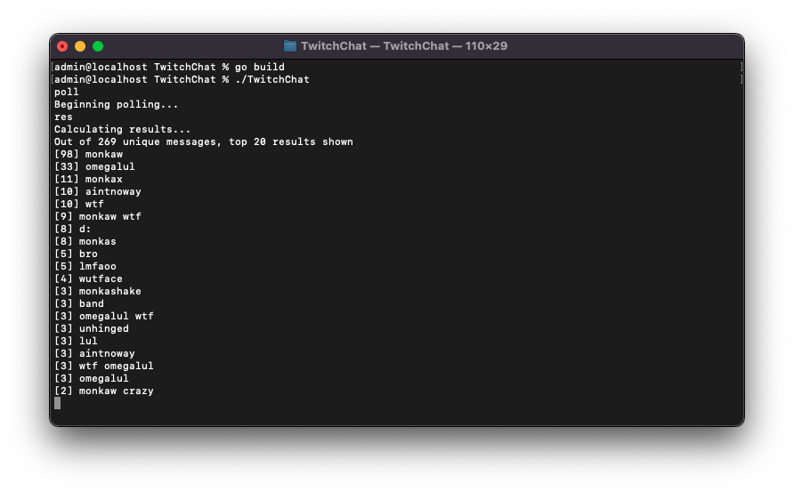

# Twitch Chat Frequency
Twitch is a livestreaming service with categories ranging from 'Game Shows' to 'Video Games'. Users can send chat messages, and read messages from others. This is a simple program (written in less than 100 lines in 30 minutes) to see the top K unique chat messages during a given polling period.

This repository is by no means a 'best practices' guide, but a quick demonstration of simple multi-threading. The command listener, chat callback and notify are all handled in separate Goroutines.

## TODO
- [x] Use sync.RWMutex for concurrent access
- [ ] Prettify this README

## Demo

## How to Setup
Here is a step-by-step guide to run this application.

1. Download and install Go for your system. [Download link](https://go.dev/dl/)
2. Download this repository using `Code > Download Zip` or using `git clone`.
3. Unzip the `TwitchChatFrequency-main.zip` file.
4. Open Terminal (macOS/Linux) or Command Prompt (Windows) and type: `go mod tidy`
5. Then `go build`

## How to Use
1. Open Terminal (macOS/Linux) or Command Prompt (Windows)
2. Type `./TwitchChat` (macOS/Linux) or `TwitchChat.exe` (Windows)
4. Type `join <channel-name>`
3. Type `poll` to start collecting chat messages
4. Type `res` to print the top 20 results
5. Type `exit` to stop the app

## Commands
| Command        | Description |
| -------------  | ------------- |
| `join <channel>` | joins a Twitch channel anonymously |
| `leave`          | leaves the current Twitch channel |
| `poll`           | begin collecting chat messages |
| `res`            | print the top K frequent chat messages |
| `exit`           | close this app |